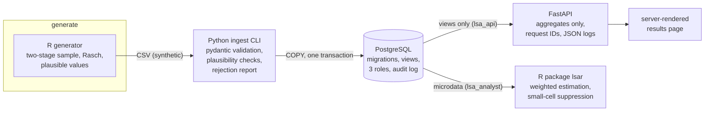

# lsa-platform

[](https://github.com/jastephan63/lsa-platform/actions/workflows/ci.yml)
[](https://github.com/jastephan63/lsa-platform/actions/workflows/release.yml)
[](LICENSE)

A personal practice project: a small end-to-end platform for a **fictional**
large-scale competency assessment, built to work through a full stack —
data generation in R, validated ingestion into PostgreSQL with Python,
weighted analysis with disclosure control as an R package, an
aggregate-only API, and the operations layer around it (Bash, Docker,
Kubernetes, Terraform for OpenStack, CI/CD).

It is a learning project, not production software: nothing here has carried
real data or real traffic, and **all data is synthetic**
([docs/data-spec.md](docs/data-spec.md)) — every school, student, and
response comes from a seeded generator. What makes it more than a toy is
that the whole thing actually runs, end to end, and every claim in this
README is enforced by a required CI job.

## What it does



The scenario is shaped like a national school assessment (cantons, language
regions, sampling weights, plausible values) because that gives every layer
a realistic job to do: the database has a reason for strict roles, the API
has a reason to refuse row-level data, and the statistics have a reason to
be weighted and disclosure-controlled.

Two design points I'd call out:

- **The same estimate is computed twice on purpose** — in SQL views and in
  the R package — and a test requires them to agree exactly, including
  which small cells get suppressed. Two implementations as mutual
  verification.
- **Least privilege is tested, not asserted**: a test connects with the
  API's own database credentials and expects `InsufficientPrivilege` when
  it tries to read student-level data.
- **Uncertainty is design-based**: jackknife replicate weights (grouped
  into variance zones) combined with Rubin's rules across plausible values
  give every published mean a standard error and confidence interval; a
  hand-computable test pins the estimator down. Finer aggregates sit behind
  an authenticated, audited API tier with the same suppression rule.

## Running it — the complete tour

Every command below is safe to paste as a block and safe to re-run. None of
the code blocks contain inline comments, because macOS's default zsh would
treat them as arguments. `make help` lists every entry point.

### 0. Prerequisites

The Docker path (steps 1–4) needs only **git, make, and a running Docker
daemon** with the compose plugin (Docker Desktop, or on macOS
`brew install colima docker docker-compose && colima start`). The
Kubernetes path (steps 5–6) additionally needs:

```bash
brew install kind kubectl kustomize
```

(Linux: install the same four tools with your package manager or the
projects' release binaries.)

### 1. Start the whole stack

```bash
git clone https://github.com/jastephan63/lsa-platform
cd lsa-platform
cp .env.example .env
make up
make smoke
```

That is: clone, copy the env template (the defaults work; change the
passwords if you like — but see the `make reset` note below), build and
start everything (db → migrations → data generation → validated ingest →
API, plus Prometheus and Grafana), then run the end-to-end checks. On a
re-run the clone step just reports the directory exists and the rest
proceeds.

### 2. Look at everything

| URL | What you see |
| --- | ------------ |
| http://localhost:8000 | the results site: national overview, canton chart with confidence intervals, proficiency bands, group comparisons, participation, item statistics — every section linked to its JSON endpoint, all browsable at `/docs` |
| http://localhost:3000 | Grafana → dashboards → *lsa-platform* → **lsa-platform API** (no login needed for viewing) |
| http://localhost:9090 | Prometheus; try the query `lsa_http_requests_total` |

The restricted tier (finer canton × SES aggregates, bearer-token
authenticated, audited):

```bash
set -a; . ./.env; set +a
curl -H "Authorization: Bearer $LSA_ANALYST_API_TOKEN" http://localhost:8000/api/restricted/cantons-by-ses
```

The token is whatever `LSA_ANALYST_API_TOKEN` says in your `.env`. Without
the header you get 401; if the variable is unset the tier is off entirely
(503).

### 3. Run the R analysis batch job

```bash
make analysis
```

Prints the publishable table — weighted mean, standard error, and 95%
confidence interval per canton, small cells suppressed — computed by the
`lsar` R package from microdata as the analyst role, and publishes it into
the database so the website and `/api/results/uncertainty` serve the same
numbers ([glossary](docs/glossary.md) explains the statistical terms).

### 4. Back up and restore

```bash
set -a; . ./.env; set +a
export POSTGRES_HOST=localhost
make backup
```

Restore with `./scripts/db_restore.sh backups/<file>.dump` (it asks for
confirmation; the CI restore drill runs exactly this round trip on every
push). Requires PostgreSQL 16 client tools on the host — or skip the local
tools and let CI demonstrate it.

### 5. The same platform on Kubernetes

```bash
set -a; . ./.env; set +a
make kind-up
./scripts/smoke_test.sh --base-url https://localhost:8443 --insecure
```

`kind-up` creates a local kind cluster, builds and loads the images,
installs ingress-nginx and cert-manager, creates the secret from your
environment (never from a file in git), deploys the Kustomize dev overlay,
and waits for readiness. The API then serves on **https://localhost:8443**
with a self-signed certificate — your browser will warn, which is expected;
`--insecure` tells the smoke suite to accept it. HTTP on :8080 redirects to
HTTPS.

### 6. Optional: let the cluster follow git (GitOps)

```bash
make gitops-up
```

Installs Argo CD into the kind cluster and points it at this repository's
`k8s/overlays/dev`; from then on the cluster reconciles itself to whatever
is on `main` instead of being pushed to. `kubectl -n argocd get
application lsa-platform` shows Synced/Healthy when it has converged.

### 7. Optional: the load-size dataset

```bash
make data-large
```

Generates ~91k students / 2.4M responses / 10.6M replicate weights
(~377 MB of CSV, a few minutes) into `data/raw`; ingest it into a running
stack with `make ingest`. What that measures — timings, query plans, and
the matview trade-off — is written up in
[docs/performance.md](docs/performance.md).

### 8. Tests and linters, locally

Everything CI runs can run locally: `make lint lint-sql lint-shell
validate-k8s validate-tf` for the linters, `make install-py test-py` for
the Python suite (needs `POSTGRES_*` in the environment and R for the data
fixture), `make check-r` for the R package. CI remains the referee — every
job is required.

### 9. Cleaning up

```bash
make down
make kind-down
```

`make down` stops the compose stack but keeps the data volumes; `make
reset` also deletes the volumes (synthetic data only) — needed if you
change `POSTGRES_PASSWORD` after the database was first created, because
PostgreSQL sets credentials only when its volume is initialised.
`make kind-down` deletes the kind cluster, Argo CD included.

## Repository layout

| Path | What lives there |
| ---- | ---------------- |
| [r/datagen](r/datagen) | Seeded synthetic-data generator ([spec](docs/data-spec.md)) |
| [python/](python) | `lsa-ingest` CLI and the aggregate-only API, with tests |
| [db/migrations](db/migrations) | Numbered SQL migrations: schema, views, roles, audit log |
| [r/lsar](r/lsar) | R package: weighted estimation, suppression (R CMD check in CI) |
| [scripts/](scripts) | Bash operations: bootstrap, backup/restore, smoke tests, logs, kind-up |
| [docker/](docker), [compose.yaml](compose.yaml) | Hardened images and the local stack |
| [k8s/](k8s) | Kustomize base + dev/prod overlays |
| [infra/](infra) | Terraform module for OpenStack ([module README](infra/README.md)) |
| [observability/](observability) | Prometheus config and the provisioned Grafana dashboard |
| [docs/](docs) | [security](docs/security.md) · [datenschutz](docs/datenschutz.md) (German) · [network](docs/network.md) · [performance](docs/performance.md) · [glossary](docs/glossary.md) · [ADRs](docs/adr) |

## Notes from building it

Some tools here were new to me when I built this (Kubernetes, Terraform,
the OpenStack vocabulary); others I already used daily (Python, R, SQL,
Bash, Git, CI, Docker). Concrete lessons the project taught me the hard
way, kept here because they're the kind of thing you only learn by running
things:

- An init container running as a uid with no passwd entry breaks
  `pg_isready` *client-side* — libpq cannot derive a default username.
- R refuses to start work without a writable temp directory, which a
  read-only root filesystem takes away; mount an emptyDir at `/tmp`.
- ingress-nginx's admission webhook lags its pod's Ready condition by a few
  seconds; applying an Ingress immediately after needs a retry.
- `pg_dump` from a newer major version emits settings an older server
  rejects — backup tooling must match the server's major version.

## Honest limits

- Never operated at scale and never applied against a real cloud project
  ([infra/README.md](infra/README.md) marks exactly what `terraform
  validate` does and does not prove).
- Plausible values use a simplified EAP draw, not operational PV
  methodology. Variance estimation is design-based (jackknife replicate
  weights combined with Rubin's rules across plausible values), but the
  nonresponse adjustment is not re-estimated per replicate — a documented
  simplification ([data spec](docs/data-spec.md)).

## License

[MIT](LICENSE) — © 2026 Jake Stephan
