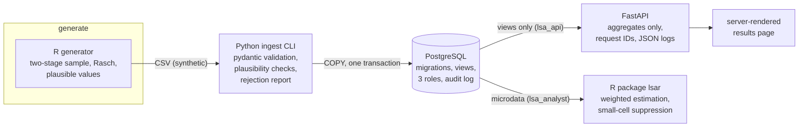

# lsa-platform

[](https://github.com/jastephan63/lsa-platform/actions/workflows/ci.yml)
[](https://github.com/jastephan63/lsa-platform/actions/workflows/release.yml)
[](LICENSE)

A personal practice project: a small end-to-end platform for a **fictional**
large-scale competency assessment, built to work through a full stack —
data generation in R, validated ingestion into PostgreSQL with Python,
weighted analysis with disclosure control as an R package, an
aggregate-only API, and the operations layer around it (Bash, Docker,
Kubernetes, Terraform for OpenStack, CI/CD).

It is a learning project, not production software: nothing here has carried
real data or real traffic, and **all data is synthetic**
([docs/data-spec.md](docs/data-spec.md)) — every school, student, and
response comes from a seeded generator. What makes it more than a toy is
that the whole thing actually runs, end to end, and every claim in this
README is enforced by a required CI job.

## What it does



The scenario is shaped like a national school assessment (cantons, language
regions, sampling weights, plausible values) because that gives every layer
a realistic job to do: the database has a reason for strict roles, the API
has a reason to refuse row-level data, and the statistics have a reason to
be weighted and disclosure-controlled.

Two design points I'd call out:

- **The same estimate is computed twice on purpose** — in SQL views and in
  the R package — and a test requires them to agree exactly, including
  which small cells get suppressed. Two implementations as mutual
  verification.
- **Least privilege is tested, not asserted**: a test connects with the
  API's own database credentials and expects `InsufficientPrivilege` when
  it tries to read student-level data.
- **Uncertainty is design-based**: jackknife replicate weights (grouped
  into variance zones) combined with Rubin's rules across plausible values
  give every published mean a standard error and confidence interval; a
  hand-computable test pins the estimator down. Finer aggregates sit behind
  an authenticated, audited API tier with the same suppression rule.

## Quick start

```bash
git clone https://github.com/jastephan63/lsa-platform
cd lsa-platform
cp .env.example .env
make up
make smoke
```

Line by line: clone, enter the directory, copy the env template (then set
your own local passwords in `.env`), start the full stack (db → migrate →
generate → ingest → api), and run 7 end-to-end checks against
http://localhost:8000. Safe to paste as a block, and safe to re-run — on a
second run the clone step just reports the directory exists and the rest
proceeds. Requires a running Docker daemon (`make up` says so if not). No
inline comments in the code block — macOS's default zsh would treat them as
arguments.

If you change `POSTGRES_PASSWORD` in `.env` *after* the database has
already been created once, run `make reset` first: PostgreSQL sets its
credentials only when its data volume is first initialised, so the old
volume must go (it holds only regenerable synthetic data).

Kubernetes instead (needs kind + kubectl + kustomize):
`set -a; . ./.env; set +a; make kind-up` — then `make smoke BASE_URL=http://localhost:8080`.

`make help` lists every entry point.

## Repository layout

| Path | What lives there |
| ---- | ---------------- |
| [r/datagen](r/datagen) | Seeded synthetic-data generator ([spec](docs/data-spec.md)) |
| [python/](python) | `lsa-ingest` CLI and the aggregate-only API, with tests |
| [db/migrations](db/migrations) | Numbered SQL migrations: schema, views, roles, audit log |
| [r/lsar](r/lsar) | R package: weighted estimation, suppression (R CMD check in CI) |
| [scripts/](scripts) | Bash operations: bootstrap, backup/restore, smoke tests, logs, kind-up |
| [docker/](docker), [compose.yaml](compose.yaml) | Hardened images and the local stack |
| [k8s/](k8s) | Kustomize base + dev/prod overlays |
| [infra/](infra) | Terraform module for OpenStack ([module README](infra/README.md)) |
| [observability/](observability) | Prometheus config and the provisioned Grafana dashboard |
| [docs/](docs) | [security](docs/security.md) · [datenschutz](docs/datenschutz.md) (German) · [network](docs/network.md) · [performance](docs/performance.md) · [ADRs](docs/adr) |

## Notes from building it

Some tools here were new to me when I built this (Kubernetes, Terraform,
the OpenStack vocabulary); others I already used daily (Python, R, SQL,
Bash, Git, CI, Docker). Concrete lessons the project taught me the hard
way, kept here because they're the kind of thing you only learn by running
things:

- An init container running as a uid with no passwd entry breaks
  `pg_isready` *client-side* — libpq cannot derive a default username.
- R refuses to start work without a writable temp directory, which a
  read-only root filesystem takes away; mount an emptyDir at `/tmp`.
- ingress-nginx's admission webhook lags its pod's Ready condition by a few
  seconds; applying an Ingress immediately after needs a retry.
- `pg_dump` from a newer major version emits settings an older server
  rejects — backup tooling must match the server's major version.

## Honest limits

- Never operated at scale and never applied against a real cloud project
  ([infra/README.md](infra/README.md) marks exactly what `terraform
  validate` does and does not prove).
- Plausible values use a simplified EAP draw, not operational PV
  methodology. Variance estimation is design-based (jackknife replicate
  weights combined with Rubin's rules across plausible values), but the
  nonresponse adjustment is not re-estimated per replicate — a documented
  simplification ([data spec](docs/data-spec.md)).

## License

[MIT](LICENSE) — © 2026 Jake Stephan
