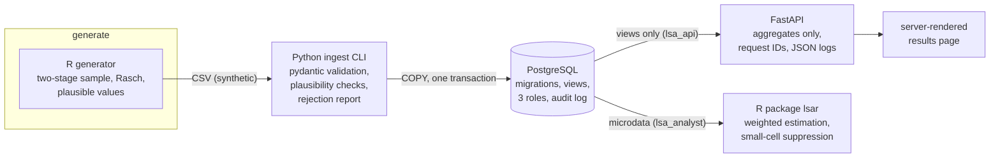

# lsa-platform

[](https://github.com/jastephan63/lsa-platform/actions/workflows/ci.yml)
[](https://github.com/jastephan63/lsa-platform/actions/workflows/release.yml)
[](LICENSE)

**Zusammenfassung auf Deutsch:** Dies ist ein Demonstrations- und
Lernprojekt, kein Produktivsystem — gebaut, um technische Fähigkeiten mit
lauffähigem Code zu belegen, ohne Verbindung zu ICER, ÜGK, PISA oder
Switch. Es bildet eine fiktive Kompetenzerhebung ab: synthetische Daten
(R), validierter Import nach PostgreSQL (Python), gewichtete Auswertung mit
Kleinzellen-Unterdrückung (R-Paket), eine Aggregat-API (FastAPI) und die
Betriebsschicht darum herum (Bash, Docker, Kubernetes, Terraform für
OpenStack, CI/CD). Alle Daten sind erfunden; jeder Befehl in diesem README
funktioniert auf einer sauberen Maschine mit Docker.
Die Zuordnung von Anforderungen zu Belegen steht in
[docs/requirements-map.md](docs/requirements-map.md).

---

This is a **demonstration and learning project, not production
experience**. It exists to evidence technical skills with working code. It
has no affiliation with ICER, ÜGK, PISA, or Switch; all data is synthetic
([docs/data-spec.md](docs/data-spec.md)); no metrics here describe any real
deployment.

## What it is

A small end-to-end platform for a fictional large-scale competency
assessment, shaped like the real thing:



Around it: multi-stage hardened **Docker** images and a one-command
**compose** stack, **Kubernetes** manifests (Kustomize base + overlays,
probes, NetworkPolicies, PDB) deployable to a local **kind** cluster,
a **Terraform** module for OpenStack (Switch Engines is OpenStack-based),
and a **CI pipeline** where every claim in this README is a required job.

## Quick start

```bash
git clone https://github.com/jastephan63/lsa-platform
cd lsa-platform
cp .env.example .env
make up
make smoke
```

Line by line: clone, enter the directory, copy the env template (then set
your own local passwords in `.env`), start the full stack (db → migrate →
generate → ingest → api), and run 7 end-to-end checks against
http://localhost:8000. Safe to paste as a block, and safe to re-run — on a
second run the clone step just reports the directory exists and the rest
proceeds. Requires a running Docker daemon (`make up` says so if not). No
inline comments in the code block — macOS's default zsh would treat them as
arguments.

Kubernetes instead (needs kind + kubectl + kustomize):
`set -a; . ./.env; set +a; make kind-up` — then `make smoke BASE_URL=http://localhost:8080`.

`make help` lists every entry point.

## Repository layout

| Path | What lives there |
| ---- | ---------------- |
| [r/datagen](r/datagen) | Seeded synthetic-data generator ([spec](docs/data-spec.md)) |
| [python/](python) | `lsa-ingest` CLI and the aggregate-only API, with tests |
| [db/migrations](db/migrations) | Numbered SQL migrations: schema, views, roles, audit log |
| [r/lsar](r/lsar) | R package: weighted estimation, suppression (R CMD check in CI) |
| [scripts/](scripts) | Bash operations: bootstrap, backup/restore, smoke tests, logs, kind-up |
| [docker/](docker), [compose.yaml](compose.yaml) | Hardened images and the local stack |
| [k8s/](k8s) | Kustomize base + dev/prod overlays |
| [infra/](infra) | Terraform module for OpenStack ([module README](infra/README.md)) |
| [docs/](docs) | [security](docs/security.md) · [datenschutz](docs/datenschutz.md) · [network](docs/network.md) · [ADRs](docs/adr) · [requirements map](docs/requirements-map.md) |

## Was ich dabei gelernt habe

Ehrlichkeit gehört zum Konzept dieses Repos, also auch hier:

- **Neu für mich in diesem Projekt:** Kubernetes (Kustomize, Probes,
  NetworkPolicies, kind), Terraform und die OpenStack-Begriffswelt
  (Neutron-Netze, Security Groups, Floating IPs). Die Manifeste und das
  Modul sind sorgfältig gebaut und CI-geprüft, aber ich habe sie nie in
  einem echten Cluster- oder Cloud-Betrieb verantwortet. Konkrete
  Stolpersteine, die dieses Projekt mich gelehrt hat: ein Init-Container
  ohne passwd-Eintrag bricht `pg_isready` client-seitig; R braucht ein
  beschreibbares `/tmp` bei read-only Root-Filesystem; der
  ingress-nginx-Webhook ist nach "Pod ready" noch kurz nicht erreichbar.
- **Bereits vertraut:** Python, R, SQL, Bash, Git, CI-Pipelines und Docker
  im Entwicklungsalltag.

## The honest limits

- Never operated at scale, never carried real data, never applied against a
  real OpenStack project ([infra/README.md](infra/README.md) marks what
  `validate` does and does not prove).
- Plausible values use a simplified EAP draw, not operational PV
  methodology; variance estimation stops at Rubin's between-imputation term
  because the synthetic design carries no replicate weights. Both
  simplifications are documented where they live.

## License

[MIT](LICENSE) — © 2026 Jake Stephan
