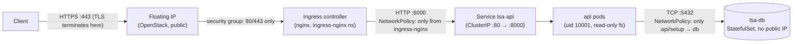

# Network path, explained

What happens between a browser and the data, and which layer enforces what.

## The hops, one by one

1. **Client → floating IP.** The only public address in the whole system
   ([infra/compute.tf](../infra/compute.tf)). The OpenStack **security
   group** admits 80/443 from anywhere and SSH only from an explicit admin
   CIDR — the module refuses to accept `0.0.0.0/0` for SSH.
2. **TLS terminates at the ingress controller.** Inside the cluster,
   traffic is plain HTTP on the pod network. That is a deliberate,
   documented trade-off: certificates and ciphers are managed in one place
   (with cert-manager in a real deployment); the cost is that in-cluster
   traffic is unencrypted, which a service mesh (mTLS) would address if the
   threat model demanded it.
3. **Ingress → Service.** The Ingress resource routes by host/path to the
   `lsa-api` Service. A Service is a stable virtual IP; kube-proxy load-
   balances connections across the ready endpoints (pods that pass the
   readiness probe — an unready pod receives no traffic).
4. **Service → pod.** Port names, not numbers, wire this together
   (`http` = 8000 on the container, 80 on the Service), so a port change is
   one edit.
5. **Pod → database.** By DNS name `lsa-db` — see below. The database has
   no public address at any layer: no floating IP (cloud), no Ingress
   (cluster), and a NetworkPolicy that admits only the api and setup pods.

## DNS inside the cluster

Every Service gets `<service>.<namespace>.svc.cluster.local`. Within the
same namespace, plain `lsa-db` resolves (that is exactly what
`POSTGRES_HOST=lsa-db` in the ConfigMap relies on); CoreDNS in
`kube-system` answers, which is why the default-deny NetworkPolicy needs an
explicit egress rule for UDP/TCP 53. `lsa-db` is a *headless* Service
(`clusterIP: None`): DNS returns the StatefulSet pod IP directly instead of
a virtual IP — the conventional shape for stateful single writers.

## Security groups vs. NetworkPolicies — who enforces what

| Layer | Object | Scope | Enforced by |
| ----- | ------ | ----- | ----------- |
| Cloud (OpenStack) | Security groups ([infra/security.tf](../infra/security.tf)) | instance ports, north-south perimeter | Neutron, outside the VMs |
| Cluster | NetworkPolicies ([k8s/base/network-policies.yaml](../k8s/base/network-policies.yaml)) | pod-to-pod, east-west | the CNI plugin |

The two are complementary: security groups know nothing about pods,
NetworkPolicies know nothing about the internet-facing perimeter. Both
follow the same principle — default deny, then allow named flows.

**Honest caveat:** NetworkPolicy enforcement depends on the CNI. Recent
kind versions enforce them; a CNI without a policy engine silently ignores
them, which is a classic false sense of security. Verifying enforcement
(try a connection that should be blocked) belongs in any real rollout.

## Ports summary

| From | To | Port | Allowed by |
| ---- | -- | ---- | ---------- |
| internet | app instance | 443/80 | security group `web` |
| admin CIDR | app instance | 22 | security group `web` |
| ingress-nginx pods | api pods | 8000 | NetworkPolicy |
| api + setup pods | db pod | 5432 | NetworkPolicy |
| all pods | CoreDNS | 53 | NetworkPolicy |
| everything else | anything | — | denied by default |
